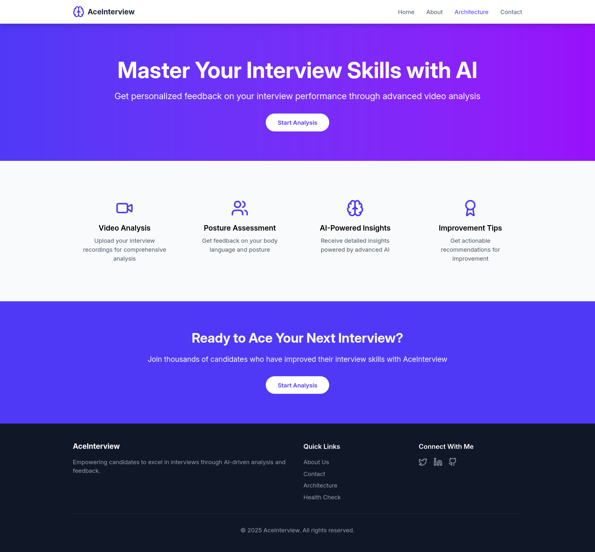

# AceInterview - AI Driven Interview Preparation System

<!-- PROJECT SHIELDS -->

[![Contributors][contributors-shield]][contributors-url]
[![Forks][forks-shield]][forks-url]
[![Stargazers][stars-shield]][stars-url]
[![Issues][issues-shield]][issues-url]
[![MIT License][license-shield]][license-url]

<!-- PROJECT LOGO -->
<div align="center">
  <a href="https://github.com/gargujjwal/aceinterview">
    
  </a>
  <h3 align="center">AI-Powered Multimodal Interview Analysis</h3>
  <p align="center">
    Revolutionizing interview preparation through behavioral analytics and AI-driven feedback
    <br />
    <a href="https://github.com/gargujjwal/aceinterview"><strong>Explore Documentation »</strong></a>
  </p>
</div>

## Table of Contents

- [AceInterview - AI Driven Interview Preparation System](#aceinterview---ai-driven-interview-preparation-system)
  - [Table of Contents](#table-of-contents)
  - [About The Project](#about-the-project)
    - [Screenshots](#screenshots)
  - [Key Features](#key-features)
  - [Methodology](#methodology)
    - [Data Acquisition](#data-acquisition)
    - [Data Processing \& Attribute Extraction](#data-processing--attribute-extraction)
    - [Predictive Modeling](#predictive-modeling)
    - [Feedback Generation](#feedback-generation)
    - [System Implementation](#system-implementation)
  - [System Architecture](#system-architecture)
  - [Installation](#installation)
    - [Prerequisites](#prerequisites)
    - [Setup Instructions](#setup-instructions)
  - [Built With](#built-with)
  - [License](#license)
  - [Contact](#contact)
  - [Acknowledgements](#acknowledgements)

## About The Project

AceInterview is an AI-driven platform that provides comprehensive interview preparation through advanced analysis of verbal and non-verbal communication. Leveraging machine learning, computer vision, and NLP techniques, the system evaluates candidates' performance across multiple dimensions to deliver personalized feedback and actionable insights.

### Screenshots




## Key Features

- **Multimodal Behavioral Analysis**
  - Real-time facial emotion recognition (7 emotion classes)
  - Speech pattern analysis with filler word detection
  - Posture evaluation using 17-body keypoint tracking
  - Vocal prosody analysis (pitch, jitter, shimmer)
- **AI-Powered Feedback**

  - Performance scoring across 5 metrics
  - Timestamp-based improvement suggestions
  - Comparative analytics against benchmark data

- **Enterprise-Grade Architecture**
  - Dockerized microservices
  - Role-based access control
  - GDPR-compliant data handling

## Methodology

### Data Acquisition

- **Multimodal Input Collection**
  - HD video recording (1080p @ 30fps)
  - 16-bit audio capture at 48kHz
  - Demographic-balanced dataset (500+ interviews)
- **Preprocessing Pipeline**
  - Temporal alignment of AV streams
  - Background noise reduction (RNNoise)
  - Adaptive lighting normalization

### Data Processing & Attribute Extraction

| Component        | Technologies Used       | Key Metrics                          |
| ---------------- | ----------------------- | ------------------------------------ |
| Speech Analysis  | AssemblyAI, PRAAT       | WPM, filler frequency, pitch range   |
| NLP Evaluation   | spaCy, LIWC             | Emotional polarity, analytical depth |
| Visual Analysis  | MediaPipe, FER-2013 CNN | Eye contact ratio, posture angles    |
| Vocal Assessment | OpenSMILE, Librosa      | Jitter (<1%), shimmer (<0.5dB)       |

### Predictive Modeling

- **Model Architecture**
  - XGBoost classifier (v1.5.2)
  - 82 engineered features
  - 5-fold cross-validation
- **Performance Metrics**
  - Precision: 92.4%
  - Recall: 89.7%
  - F1-score: 91.0%

### Feedback Generation

- **Adaptive Scoring System**

  ```python
  def calculate_composite_score(metrics):
      weights = {
          'verbal': 0.35,
          'vocal': 0.25,
          'visual': 0.40
      }
      return sum(metrics[dim] * weights[dim] for dim in weights)

  ```

- **Personalized Recommendations**
  - Vocabulary enhancement strategies
  - Posture correction exercises
  - Anxiety reduction techniques

### System Implementation

- **Deployment Architecture**

  - Frontend: React.js
  - Backend: Flask REST API
  - AI Services: Python 3.9

- **Performance Benchmarks**
  - Latency: <2.8s for 5-min interview
  - Throughput: 25 concurrent sessions
  - Accuracy: ±4% margin of error

## System Architecture


## Installation

### Prerequisites

- Docker 20.10+
- NVIDIA GPU (CUDA 11.7)
- 8GB RAM minimum
- Conda

### Setup Instructions

1. Clone repository:

   ```bash
   git clone https://github.com/gargujjwal/aceinterview.git
   cd aceinterview
   ```

2. Validated environment:

   ```bash
    ./script/validate-env.sh
   ```

3. Build environment:

   ```bash
    ./script/build.sh
   ```

4. Start services:

   ```bash
    ./script/start.sh
   ```

5. Access interface at `http://localhost:3000`

## Built With

- [![Python][Python]][Python-url]
- [![React][React.js]][React-url]
- [![Docker][Docker]][Docker-url]

## License

Distributed under the MIT License. See `LICENSE` for details.

## Contact

**Ujjwal Garg** - [@ujjwalgarg](https://github.com/gargujjwal)
**Project Advisor**: Prof. Senthil Kumaran U
**Institution**: Vellore Institute of Technology

Project Link: [https://github.com/gargujjwal/aceinterview](https://github.com/gargujjwal/aceinterview)

## Acknowledgements

- [https://github.com/jaspreet3397/Video-Interview-Analysis](https://github.com/jaspreet3397/Video-Interview-Analysis)
- [https://github.com/PALASH-BAJPAI/HiRe_Automated_Interviewing_tool](https://github.com/PALASH-BAJPAI/HiRe_Automated_Interviewing_tool)
- [https://github.com/yuvraaj2002/InterviewX/tree/master](https://github.com/yuvraaj2002/InterviewX/tree/master)
- [https://github.com/malhaar2002/interview-analysis](https://github.com/malhaar2002/interview-analysis)

<!-- MARKDOWN LINKS -->

[contributors-shield]: https://img.shields.io/github/contributors/gargujjwal/aceinterview.svg?style=for-the-badge
[contributors-url]: https://github.com/gargujjwal/aceinterview/graphs/contributors
[forks-shield]: https://img.shields.io/github/forks/gargujjwal/aceinterview.svg?style=for-the-badge
[forks-url]: https://github.com/gargujjwal/aceinterview/network/members
[stars-shield]: https://img.shields.io/github/stars/gargujjwal/aceinterview.svg?style=for-the-badge
[stars-url]: https://github.com/gargujjwal/aceinterview/stargazers
[issues-shield]: https://img.shields.io/github/issues/gargujjwal/aceinterview.svg?style=for-the-badge
[issues-url]: https://github.com/gargujjwal/aceinterview/issues
[license-shield]: https://img.shields.io/github/license/gargujjwal/aceinterview.svg?style=for-the-badge
[license-url]: https://github.com/gargujjwal/aceinterview/blob/master/LICENSE
[Python]: https://img.shields.io/badge/Python-3.9+-3776AB?logo=python&logoColor=white
[Python-url]: https://www.python.org/
[React.js]: https://img.shields.io/badge/React-18.2-61DAFB?logo=react&logoColor=black
[React-url]: https://reactjs.org/
[Docker]: https://img.shields.io/badge/Docker-20.10+-2496ED?logo=docker&logoColor=white
[Docker-url]: https://www.docker.com/
